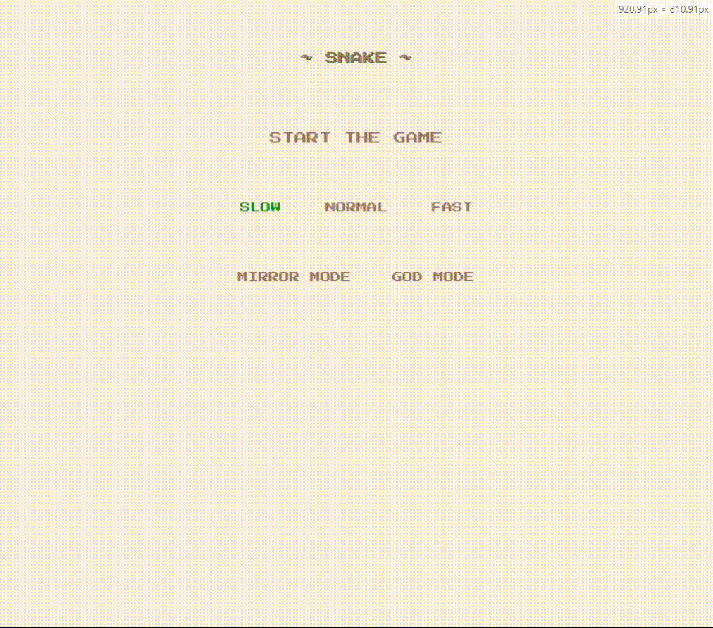
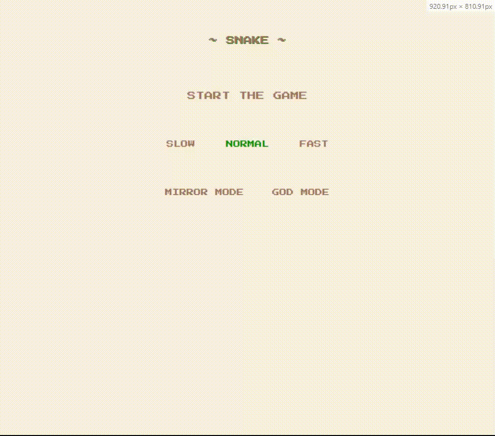
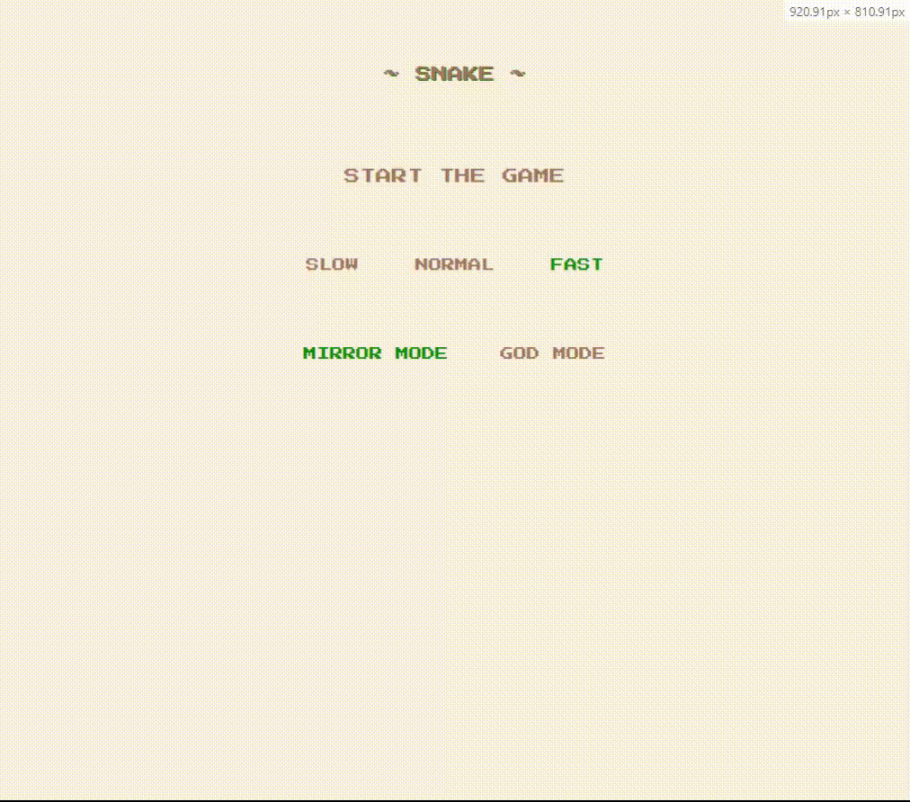

# SNAKE GAME

The project was created to organize my knowledge of frontend technologies based on the snake game.

## setup

Please use following commands:

```
npm i
```
```
npm start
```

## Technologies

- react
- react-redux
- react-redux-toolkit
- typescript
- react-jss

## DEMO

STANDARD:



MIRROR MODE (The snake could go through walls):


GOD MODE (The snake never die):


## TODO:

- refactor
- fix eslint